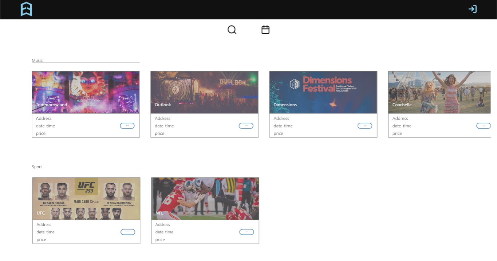

<!--
ne bi bilo lose napravit neki ljepi cover page
znas,
kako dokumenti inace imaju
 -->

## 1. Sažetak

<!-- - (max.	1	stranica) -->
 

## 2. Uvod i motivacija (max. 2 - 3 stranice)

<!-- - Dati kratki opis aplikacije koju razrađujemo (ciljano tržište, korisnici, te glavne prednosti koje će se
  ostvariti uvođenjem takve aplikacije u odnosu na dostupna rješenja).
- Potrebno je razložiti ciljano tržište aplikacije, opisati postojeća i konkurentska rješenja te priložiti
  SWOT analizu. Ukoliko nema konkurentskih rješanja, nego se radi o inovaciji, opisati kako se odvijao
  dosadašnji proces (npr. ručno, kroz excel dokumente, papirologiju, ...). Kroz SWOT analizu istaknuti
  bitne prednosti uvođenja takvog rješenja. Navesti koje su sve predispozicije potrebne za uvođenje
  aplikacije, ukoliko je to potrebno (npr. neka organizacija s kojom komuniciramo treba ostvariti web
  servis za pristup podacima i slično). Navesti tko sve ima koristi od uvođenja takve aplikacije, što ne
  moraju nužni biti samo krajnji korisnici, nego i neke organizacije iza toga ili s kojima se komunicira. -->

 

Cilj projekta, u sklopu kolegija programsko inženjerstvo, bio je napraviti jasnu, preglednu, čistu i pristupačnu web aplikaciju, jednostavnog ali učinkovitog dizajna. Namjena aplikacije je djeljenje odnosno, objavu događaja kao i za jednostavan pronalazak istih prema vlasitim željama i ukusu.

**Ciljano tržište** je sva populacija kojoj je dozvoljen posjet događaja (dakle dobna granica ovisiti će o pojedinom događaju), odnosno koji žele provesti neko vrijeme prisustvujući na nekom od organiziranih, javnih događaja; poput primjerice grupnih rekreativnih sportstkih aktivnosti, glazbenih nastupa i događaja, online događaja (edukativni, 'entertainment'), kinematografskog sadržaja... **Korisnici** aplikacije su stoga ljudi koji žele proširiti glas o nekom događaju ili ljudi koji žele posjetiti neki događaj.

 

Mnogo modernih stranica (/web aplikacija) je ultra nabrijano dizajnirano. Svašta se dešava. Reklame skaču na sve strane. Stranice sa svrhom koju mi nastojimo ispuniti nisu puno drugačije. Naša stranica trebala bi biti jasna, čista, pregledna i nenapadna, **prednost** toga bilo bi veće usmjerenje pažnje na same događaje. _Prednost_ je i manja potrošnja kapaciteta mozga koju će korisnici upotrebljavati tijekom korištenja naše aplikacije (pažnja se neče rasipati na nepotreban sadržaj, jer ga neće ni biti).

_Druga prednost_ je ta da aplikacija ima jednu glavnu svrhu. Bazirana je isključivo oko društvenih događaja; Za razliku od drugih aplikacija koje uz mogućnost objave/pretrage događaja pružaju mnoge druge usluge, primjerice facebook, odnosno aplikacija kojima svrha nije bazirana primarno oko društvenih događaja. To je prednost iz dva razloga. Jedan je taj da korisnik može koristiti aplikaciju samo sa jednom svrhom, drugi je da zbog veće specjalizacije možemo bolje prilagoditi usluge ciljanom tržištu.

    Mnogo ljudi ima korisničke profile na raznim durštvenim mrežama, poput facebook-a. Facebook primjerice ima integriranu mogućnost za objavu događaja. No Facebook nije u redu. Koristite našu aplikaciju. Nemojte podupirati kriminalne ili polu-kriminalne organizacije pod vodstvom ljudi upitnih moralnih načela.

## 3. Razrada funkcionalnosti (4 - 8 stranica)

<!-- - Opisati i grupirati funkcionalnosti po skupinama korisnika (pr. administrator, menadžer, korisnik
  smartphone-a, ...). Priložiti "Use Case" dijagram cijelog sustava. Ukoliko je potrebno, može se
  napraviti i "Use Case" dijagram posebno za dijelove sustava, no svakako mora postojati jedan početni
  krovni dijagram cijelog sustava. Navesti i opisati način na koji će aplikacija komunicirati sa ostalim
  sustavima (pr. sustavi u postojećim ustanovama, vladini sustavi, ...) što također mora biti vidljivi na
  "Use Case" dijagramu. Opisati korisničke scenarije na temelju kojih je
  izrađen dijagram. -->

 

- Opisati i grupirati funkcionalnosti po skupinama korisnika (pr. administrator, menadžer, korisnik
  smartphone-a, ...). Priložiti "Use Case" dijagram cijelog sustava.

Posjetitelj:
  - pregled događaja (uz mogućnost filtriranja po željenim kriterijima)
  - kreiranje korisničkog računa

Korisnik:
  - pregled i filtriranje događaja
  - objava događaja
  - označavanje događaja (like/watch)

Početni Use Case dijagram izgledao je ovako:   

- Ukoliko je potrebno, može se
  napraviti i "Use Case" dijagram posebno za dijelove sustava, no svakako mora postojati jedan početni
  krovni dijagram cijelog sustava. Navesti i opisati način na koji će aplikacija komunicirati sa ostalim
  sustavima (pr. sustavi u postojećim ustanovama, vladini sustavi, ...) što također mora biti vidljivi na
  "Use Case" dijagramu. Opisati korisničke scenarije na temelju kojih je
  izrađen dijagram.

Novi use case dijagram, prilagođen stvarnoj aplikaciji:   
   
potreban opis novog dijagrama

### 3.1. Prototip sučelja

<!-- - Ako želite, priložiti i kako je izgledao prototip sučelja za aplikaciju. To može biti u obliku nekoliko
  "ekrana": prijava, početni izbornik (ako ima), podešavanje opcija (ako treba) te svakako ekrane za
  kompliciranije procese. -->

Home (glavna stranica) u prototipu bila je zamišljena ovako:   

Sa Home stranice posjetitelj može pristupiti dijelu za prijavu (i, registraciju):    

Prijavom korisniku se u toolbar-u pojavljuje mogućnost za kreiranje eventa:    

Korisnički profil bio je zamišljen ovako:    

Pritiskom na 'full info' sa korisničkog profila prikazuje se koje je podatke korisnik spremio o sebi:    

Na dnu stranice 'UserProfile' zamišljeno je da stoje mogućnosti za uređivanje/brisanje korisničkog profila:    

Također, u prvobitnoj ideji bilo je zamišljeno da korsinik ima mogućnost pregleda događaja koje je objavio, te uređivanja/brisanja istih:    

### 3.2. Klasni dijagram

Početni klasni dijagram:   

**Treba napravit novi, prilagođen**

- Sastaviti klasni dijagram (eng. Class diagram) za objekte iz domene aplikacije koji se spremaju na
  bazu/backend (Korisnik, Račun, Artikl …) te pojasniti po potrebi ključne dijelove dijagrama (npr. zbog čega se negdje koristi agregacija, kompozicija, nasljeđivanje) ako to nije intuitivno jasno.

## 4. Implementacija (3-5 stranica)

- Dokumentirati koristeći klasne dijagrame na koji način su riješene ključne funkcionalnosti u
  aplikaciji (npr. Izrada računa, …) gdje je vidljivo koje se Vue komponente koriste
  (views/components), te na koji način su povezane. Vue komponentu prikazati kao jednu klasu i
  njezine „data“ kao atribute.

#### 4.2 implementacija str.2

#### 4.3 implementacija str.3

## 5. (Opcionalno) Korisničke upute (4 - 6 stranica)

- Pojasniti način na koji se koristi aplikacija koristeći screenshote sa stvarnog sučelja aplikacije

Početna stranica trebala bi biti jednostavna, bez nerazumljivih djelova. U gornjem desnom kutu posjetitelj stranice može otići na stranisu za prijavu i registraciju (registracijom odnosno, prijavom u aplikaciju korisnik ostvaruje sve mogućnosti aplikacije).

Toolbar pruža većinu mogućnosti koje korisnik može ostvariti pomoću aplikacije. Mogućnosti su redom:

- kalendar: pruža mogućnost biranja prikazanih događaja po datumu
- filtri: mogućnost filtriranja po ostalim informacijama, poput naziva i lokacije
- add (+): vodi korisnika na novi prozor gdje su ponuđena polja za unos podataka o događaju
  

 

**TU MOŽE DOĆ SLIKA FILTRA (klendar i filters)**

Pritiskom na 'more' na bilo kojoj kartici korisnik će biti preusmjeren na odgovarajući prozor na kojem su prikazani svi podaci o pojedinom događaju; također, korisnik ima mogućnost označiti pojedini događaj sa ikonom oko ili srce kako bi sam kreator događaja imao uvid u broj zainteresiranih (srce označava veću sigurnost da će korisnik doći a oko zainteresiranost i manju mogućnost dolaska).  

Mogućnost oznake sa dolaskom može ostvariti samo prijavljeni korisnik.

Tu još može doć jedna stranica kad user bude imao gotov profile page
